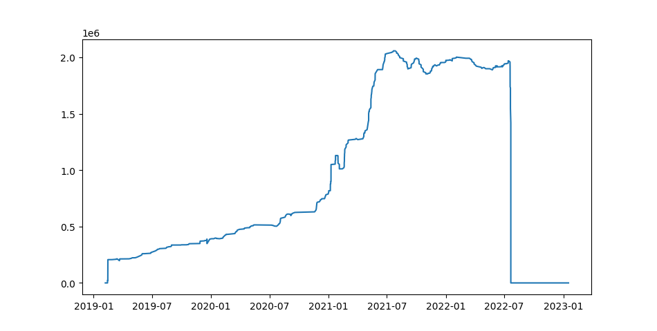

# Ethereum Transaction Visualizer

This Python script allows you to visualize the historical balance of an Ethereum address over time by fetching its transactions from the Etherscan API. It calculates the balance after each transaction (both regular and internal transactions) and plots it using `matplotlib`.

## Features

* Fetches transaction data (including internal transactions) for a given Ethereum address using the Etherscan API.
* Calculates the balance of the address after each transaction, accounting for transaction fees (gas).
* Sorts transactions by timestamp to accurately represent the balance progression.
* Visualizes the historical balance using a Matplotlib plot, showing balance changes over time.

## Prerequisites

Before running this script, you need:

* **Python 3.x**
* **An Etherscan API Key**: You can obtain one by signing up on the [Etherscan website](https://etherscan.io/myapikey).
* **Required Python Libraries**: Listed in `requirements.txt`.

## Installation

1.  **Clone the repository:**

    ```bash
    git clone [https://github.com/AdityaMalik7/Ethereum_Transactions.git](https://github.com/AdityaMalik7/Ethereum_Transactions.git)
    cd Ethereum_Transactions
    ```

2.  **Install the necessary Python libraries from `requirements.txt`:**

    ```bash
    pip install -r requirements.txt
    ```

## Usage

1.  **Set your Etherscan API Key:**
    Open the `main.py` (or whatever you named the script) file and replace `"EKK92GU16TR27CA55HRUFYSBFYC7W8MSBP"` with your actual Etherscan API key.

    ```python
    API_KEY = "YOUR_ETHERSCAN_API_KEY" # Replace with your Etherscan API Key
    ```

2.  **Specify the Ethereum Address:**
    Change the `address` variable to the Ethereum address you want to analyze.

    ```python
    address = "0x73bceb1cd57c711feac4224d062b0f6ff338501e" # Replace with the desired Ethereum address
    ```

3.  **Run the script:**

    ```bash
    python etherscan.py
    ```

  
## Screenshots
Here's an example of the historical balance plot generated by the script:

A Matplotlib plot will appear, showing the historical balance of the specified Ethereum address. The x-axis represents time, and the y-axis represents the Ethereum balance.




## Code Structure

* `API_KEY`: Your Etherscan API key.
* `address`: The Ethereum address to track.
* `BASE_URL`: The base URL for the Etherscan API.
* `ETHER_VALUE`: A constant used for converting Wei to Ether.
* `make_api_url(module, action, address, **kwargs)`: A helper function to construct Etherscan API URLs.
* `get_account_balance(address)`: Fetches the current balance of an Ethereum address. (Note: This function is defined but not used in the main execution flow for the plotting.)
* `get_transactions(address)`:
    * Fetches both regular and internal transactions for the given address.
    * Combines and sorts the transactions by timestamp.
    * Iterates through transactions, updating the balance based on inflows, outflows, and gas fees.
    * Plots the historical balance using `matplotlib`.


